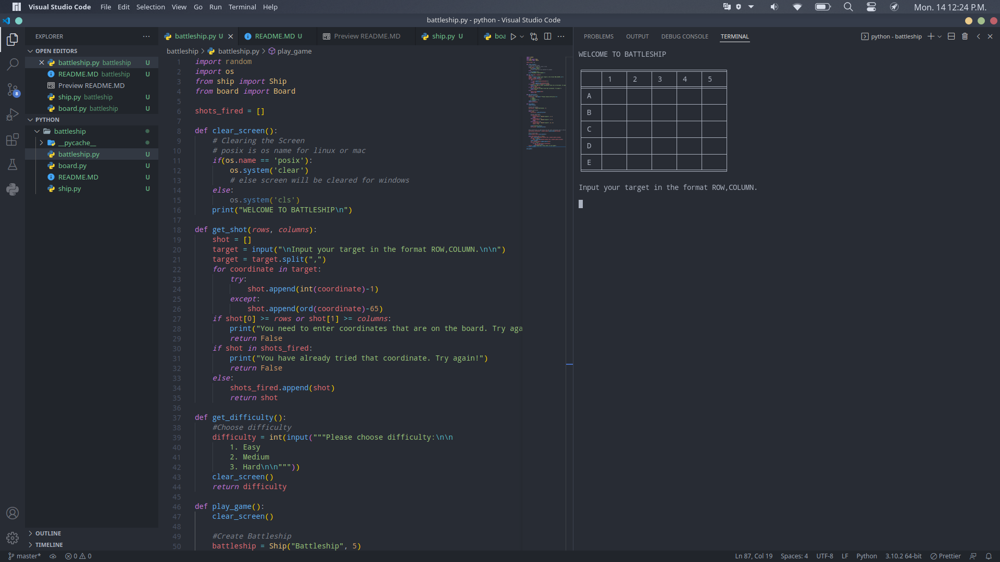

# Battleship
> A simple terminal based battleship game made with Python.

## Table of contents
* [General info](#general-info)
* [Screenshots](#screenshots)
* [Technologies](#technologies)
* [Setup](#setup)
* [Features](#features)
* [Status](#status)
* [Inspiration](#inspiration)
* [Contact](#contact)

## General info
This project was started as part of the Computer Science program with codecademy.com

## Screenshots


## Technologies
* Manjaro Linux - Version
* VS Code - Version 1.65.2
* Python - Version 3.10.2

## Setup
Save all files into the same folder. Must have the tabulate package installed. Then run the following from a terminal window:
```console
    python battleship.py
```

## Code Examples
to follow

## Features
List of features:
* Create a game board with 3 different size options depending on difficulty selected
* Randomly place different numbers of ships on the board depending on difficulty selected
* Input coordinates to try and attack the battleship
* Inform when there is a hit or a miss and update the board
* Indication of successfully sinking a ship

To-do list:
* User input validation
* Score counter
* Add 2 player functionality

## Status
Project is: _in progress_
# _finished_, _no longer continue_ and why?

## Inspiration
Based on the classic game Battleship

## Contact
Created by [@timjquigg](https://github.com/timjquigg) - feel free to contact me!